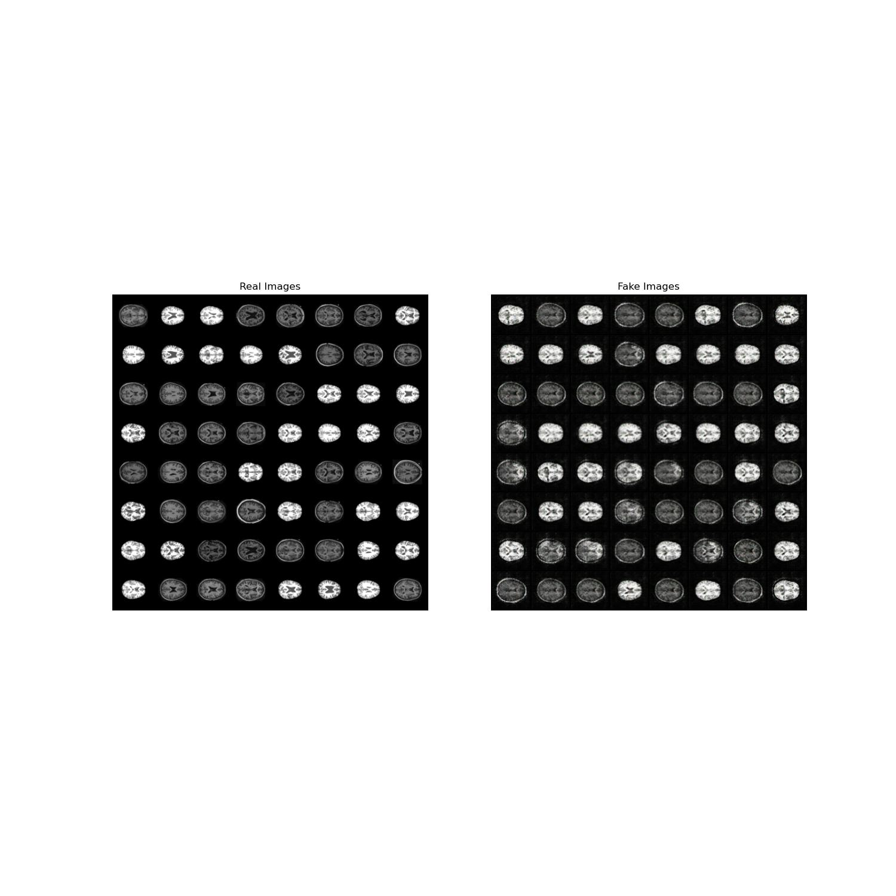

# DCGAN on OASIS Dataset

This repository contains an implementation of a **Deep Convolutional Generative Adversarial Network (DCGAN)** trained on the **OASIS** dataset. The model is designed to generate synthetic brain scan images based on the dataset provided.

## Theory & Background
Generative Adversarial Networks (GANs) consist of two neural networks, a **generator** and a **discriminator**, that are trained simultaneously through adversarial learning:

- The **generator (G)** takes in a random noise vector and generates fake images that resemble the real dataset.
- The **discriminator (D)** evaluates images and tries to distinguish between real and fake images.
- The generator is optimized to fool the discriminator, while the discriminator is optimized to correctly classify images.

DCGANs extend this concept using convolutional layers to improve the quality of generated images.

## Model Architecture
### Generator:
- Uses **transposed convolutional layers** to upsample random noise into an image.
- Includes **batch normalization** and **ReLU activation** for stable training.
- Outputs images using a **Tanh activation function**.

### Discriminator:
- Uses **convolutional layers** with **LeakyReLU activation** to classify images as real or fake.
- Includes **batch normalization** for improved gradient flow.
- Outputs a probability score using a **Sigmoid activation function**.

## Installation & Setup
### Prerequisites:
- Python 3.12+
- PyTorch
- Torchvision
- Matplotlib
- NumPy

## Training
Run the training script:
```bash
python torch_dcgan.py
```


## Results
After training, the model will generate synthetic images. The results are saved as:
- `brains.jpg`: Comparison of real vs. generated images.
- `loss.jpg`: Training loss curves for generator and discriminator.




## References
- Radford, A., Metz, L., & Chintala, S. (2015). **Unsupervised Representation Learning with Deep Convolutional Generative Adversarial Networks**.
- OASIS Dataset: [https://www.oasis-brains.org/](https://www.oasis-brains.org/)
- PyTorch DCGAN Tutorial: [https://pytorch.org/tutorials/beginner/dcgan_faces_tutorial.html](https://pytorch.org/tutorials/beginner/dcgan_faces_tutorial.html)

## License
MIT License. Feel free to modify and use the code!
